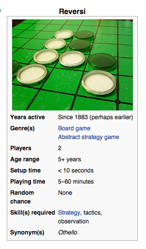
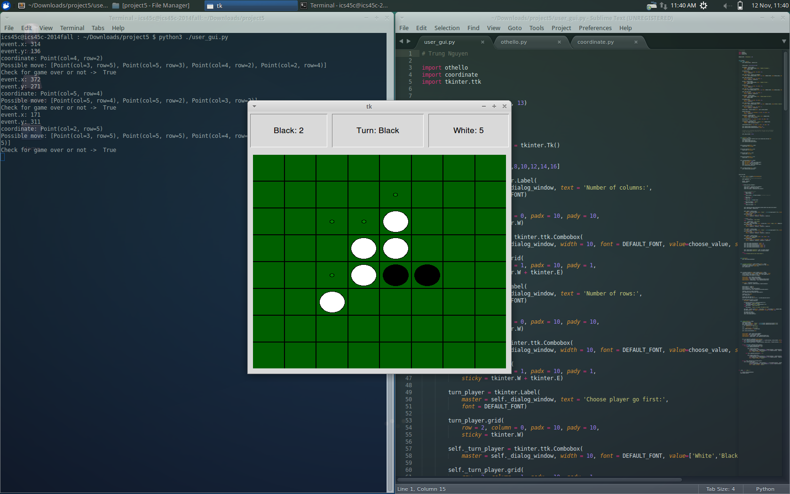

On Linux / MacOS / *nix system run command :

$ python3 ./user_interface.py

=============================================

Reversi (Othello) is a strategy board game for two players, played on an 8×8 uncheckered board. There are sixty-four identical game pieces called disks (often spelled "discs"), which are light on one side and dark on the other. Players take turns placing disks on the board with their assigned color facing up. During a play, any disks of the opponent's color that are in a straight line and bounded by the disk just placed and another disk of the current player's color are turned over to the current player's color.

The program

This project is to build a graphical user interface that implements the same Othello game as the previous project. As before, the user will begin by selecting a set of options that configure how the game will be played; the game will then be played by asking users to make moves in a graphical window, continuing untli the game is complete, at which point the game has ended and the window can be dismissed.

Some details about the GUI-based version of Othello

Othello will begin by asking users to make the same choices:

How many rows are on the board, an even integer between 4 and 16 inclusive
How many columns are on the board, an even integer between 4 and 16 inclusive, which does not have to be the same as the number of rows
Which player — black or white — will move first
The arrangement of the four discs in the center of the grid at the beginning of the game — black in the upper-left of the four cells with discs, or white?
Whether the game will be won by the player with more discs or fewer discs (one or the other, but not both)
Once the game begins, the GUI should display the current score (i.e., how many discs of each color are on the board), a clean representation of the game board as a grid with discs colored either black or white, and an indication of whose turn it is to move (black or white). The user is permitted to make a move by clicking one of the squares on the grid, though the move will only be allowed if it is valid; once a valid move is made, the board is updated to reflect the necessary changes (i.e., which discs are flipped, etc.).

When the game is over, display three things in the GUI: the score, the final game board, and who the winner is. Be sure to handle the case where there is no winner (i.e., the number of discs on the board for both players is equal at the end of the game).

Please check out wikipedia for more specific rule to play --> http://en.wikipedia.org/wiki/Reversi
